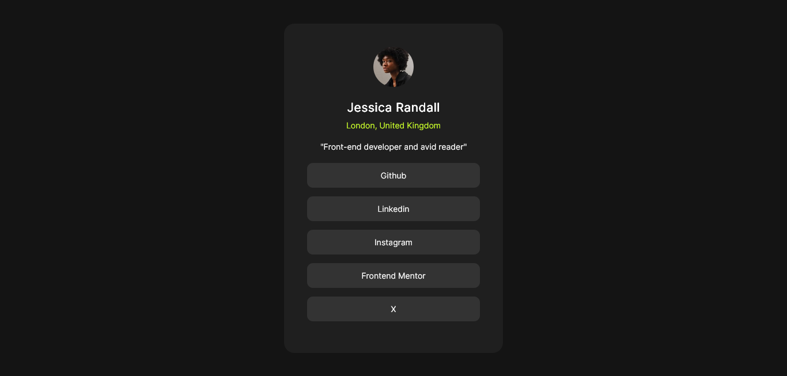

# Frontend Mentor - Social links profile solution

This is a solution to the [Social links profile challenge on Frontend Mentor](https://www.frontendmentor.io/challenges/social-links-profile-UG32l9m6dQ). Frontend Mentor challenges help you improve my coding skills by building realistic projects.

## Table of contents

- [Overview](#overview)
  - [Screenshot](#screenshot)
  - [Links](#links)
- [My process](#my-process)
  - [Built with](#built-with)
  - [What I learned](#what-i-learned)
- [Author](#author)

## Overview

### Screenshot

### Links

- Live Site URL: [Social links profile Awan]()

## My process

### Built with

- Semantic HTML5 markup
- Static Font
- CSS (flexbox, media query, transition, hover, @font-face)

### What I learned

In this project I learned how to add static font in CSS, responsive, hover, add font in css, and transition.

## Author

- Frontend Mentor - [@soniawan](https://www.frontendmentor.io/profile/soniawan)
